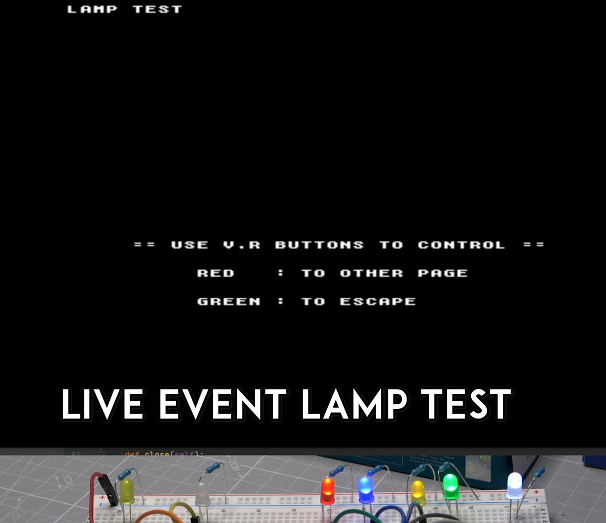

What's this? 
============

## This is the seed for something better
This is a simple test script that you can use and adapt
to send MAME commands to your arduino on your own cabinet
you're encouraged to improve it as you wish but in no
way this is something to become a production or a final
product, this is made for makers only.
It's my first Python script so some errors are expected.

## Why
This script retrieves MAME output via <ip:8000> and
maps the output to a byte lamps, the output of the lamps
will be processed and sent back to an arduino via serial
communication. This script was used for testing purposes
during a live event on:
Twitch https://www.twitch.tv/kabukiflux

Installation
============
You need to install Python 3 on your system
and pyserial as well

How to use
============
This script will send mame commands to arduino via 
serial port 

1- Configure serial port below to the arduino 'com5'
'com3' in Windows '/dev/ttyUSB0' or whatever in Linux
it will autodetect the first port available if you
don't set it.

2- Ensure mame.ini OSD OUTPUT OPTIONS output is
set to 'network'.

3- In output_map.json you can set the mame message for 
the right real output on arduino, the "default" part 
includes all the regular mappings but you can override
it by using the mame name of the game.

4- Run MAME or MAME game.

5- Execute this script (if MAME is closed it will wait)
`./mame_output_to_arduino.py`

6- WARNING: If this doesn't work check the antivirus/firewall
and set some exceptions for MAME app in network.

MAME part
============
A good way to test the output is to open Virtua Racing
go to the test page and choose output test.

Arduino part
============
Just open the file mame_tcp_leds.ino in the arduino IDE,
choose the pins to output on the top of the script on
the array called byte pins[] you can choose there the
digital outputs for your arduino. Send to the arduino.
That's all. Tested on an Arduino Nano.

DISCLAIMER (MIT Licensing)
==========================
Permission to use, copy, modify, and distribute this software for any
purpose with or without fee is hereby granted, provided that the above
copyright notice and this permission notice appear in all copies.

The software is provided "as is" and the author disclaims all warranties
with regard to this software including all implied warranties of
merchantability and fitness. In no event shall the author be liable for
any special, direct, indirect, or consequential damages or any damages
whatsoever resulting from loss of use, data or profits, whether in an
action of contract, negligence or other tortious action, arising out of
or in connection with the use or performance of this software.
